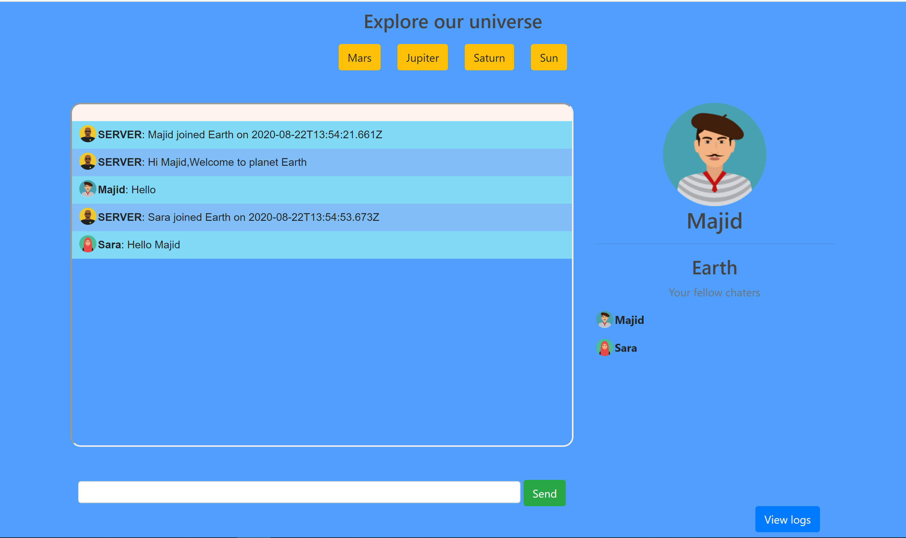

## What is this repo?

This is a Simple chat application using sokcet.io a java script library for real time event based communication. Users will enter the landing page where they choose an avatar and nickname. They will move into General chat room which is "Earth". They can later change to other room where are named after other planets. We use mango DB atlas to save log events such as messages and login/logouts.
On front we use JQuery to interact with our nodeJs server.

 

      
  

### Technologies and tools used in this project

- [Socket.io](https://socket.io/) - A java script real-time bidirectional and event-based communication.
- [JQuery](https://jquery.com/) - A fast, small, and feature-rich JavaScript library for HTML document traversal and manipulation, event handling, animation, and Ajax calls.
- [MongoDB-Atlas](https://www.mongodb.com/cloud/atlas) - Cloud noSQL document based DB
- [Express.js](http://expressjs.com/) - Web application framework for handling REST requests and responses
- [NodeJs](https://nodejs.org/) - Javascript runtime environment
- [Mongoose](https://mongoosejs.com/) - object data modeling (ODM) library for MongoDB and Node.js
